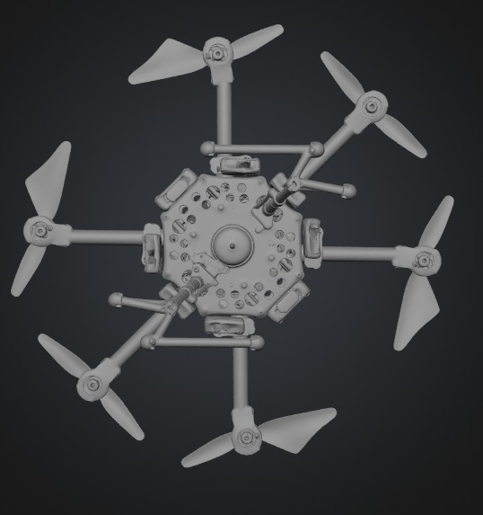
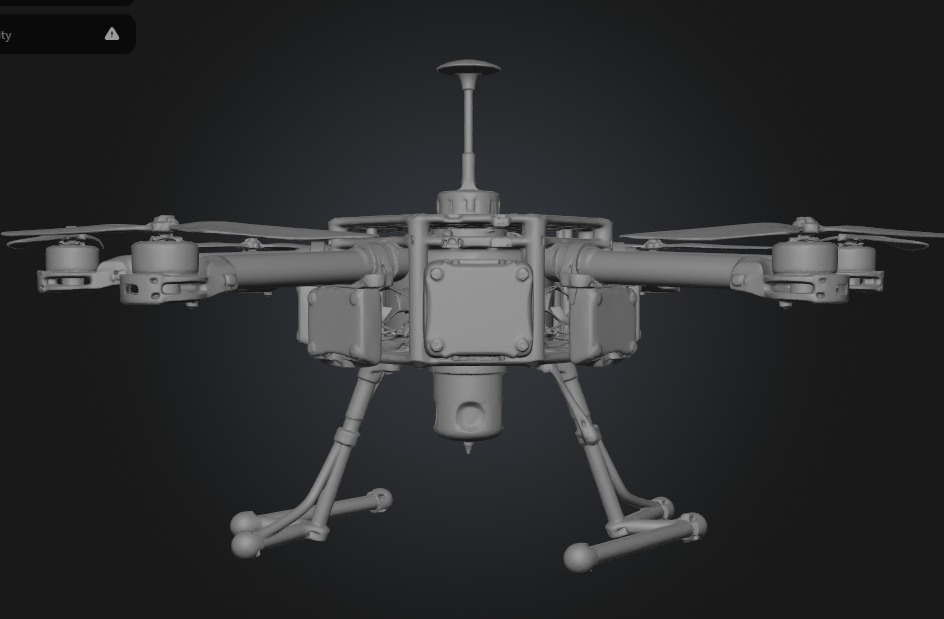
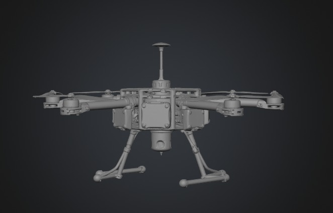
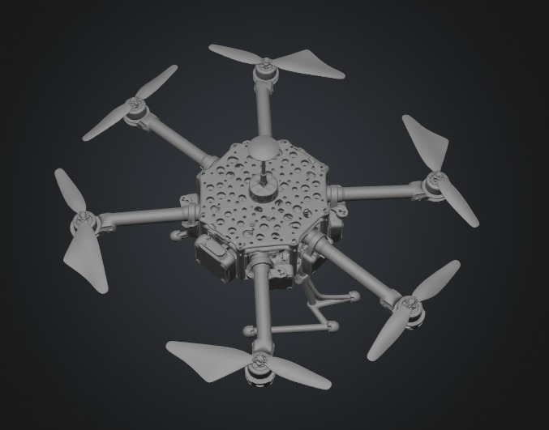
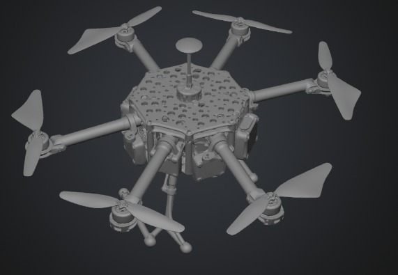
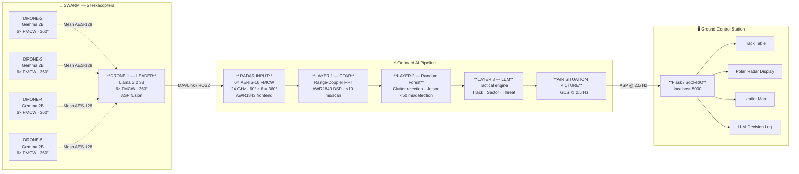

# Aran Technologies — MBC-3 Collaborative Drone Radar System


> **Mehar Baba Competition-3 (MBC-3) — Indian Air Force**
> Aran Technologies | aranrobotics@gmail.com | Phase I — New Delhi, July 2026

---

## Overview

Five-hexacopter swarm operating as a distributed airborne FMCW radar system for the IAF MBC-3 competition. Each drone carries six AERIS-10 24 GHz radar panels providing full 360° coverage. A three-layer onboard AI pipeline (CFAR → Random Forest → LLM tactical engine) processes detections autonomously and publishes a consolidated Air Situation Picture to a Flask/SocketIO Ground Control Station.

**Key capabilities:**
- 5-drone parallel sector survey with real-time FMCW radar fusion
- Autonomous leader election and graceful degradation on drone loss (< 2 s recovery)
- Single-drone ISR mode: survey grid → MPC obstacle avoidance → multi-target orbit → RTL
- Live GCS dashboard with radar polar display, Leaflet map, and ASP screen

**Stack:** PX4 SITL · Gazebo Harmonic · ROS2 Jazzy · MAVSDK Python · Flask/SocketIO

---

## Demo

**Demo video (4 min · 1920×1080)**

<video src="mbc3_single_drone_demo.mp4" controls title="MBC-3 Single-Drone ISR Mission Demo" width="100%"></video>

| Phase | Result | Detail |
|-------|--------|--------|
| Mission upload | ✅ Pass | 11 / 11 waypoints |
| Survey | ✅ Pass | 11 WPs · 0 avoidances |
| PRIMARY orbit | ✅ Pass | 50.0 m radius · locked ±0.5 m |
| RTL + map save | ✅ Pass | Landed · 3D map saved |

---

## Setup

### 1. System Requirements

| Requirement | Version |
|-------------|---------|
| OS | Ubuntu 24.04 |
| ROS2 | Jazzy |
| Gazebo | Harmonic |
| Python | 3.10+ |
| PX4-Autopilot | Built at `~/PX4-Autopilot` |

### 2. Install Python dependencies

```bash
pip install mavsdk flask flask-socketio requests numpy scipy scikit-learn
pip install colcon-common-extensions
```

### 3. Install drone model into PX4

```bash
bash new_drone/install_px4_model.sh
```

### 4. Build ROS2 workspace

```bash
bash setup_ws.sh
# Builds aeris10_driver + radar_fusion into ~/ros2_ws
```

### 5. Verify setup

```bash
bash tools/pre_demo_check.sh
# All 7 checks must pass before launch
```

---

## Quick Start

**Swarm (competition mode):**
```bash
MBC3_MODE=1 bash swarm_launch.sh
# GCS → http://localhost:5000
```

**Single-drone:**
```bash
./launch.sh              # with Gazebo GUI
./launch.sh --headless   # headless
```

**Record demo video:**
```bash
sudo apt install -y wmctrl
bash record_single_drone.sh   # → mbc3_single_drone_demo.mp4 (4 min, 1920×1080)
bash record_demo.sh           # → swarm demo (5 min, 1920×1080)
```

**Kill one drone (failover demo):**
```bash
bash tools/kill_drone_sim.sh 2   # kills DRONE-2, triggers redistribution
```

---

## Drone Specifications

| Parameter | Value |
|-----------|-------|
| Configuration | 6-arm hexacopter (X-hex) |
| AUW | 4.267 kg |
| Arm length | 360 mm |
| Prop diameter | 276 mm (10.9 in) |
| Max thrust | 117.9 N (TWR 2.82) |
| Endurance | ~32 min (6S 10,000 mAh) |
| Radar payload | AERIS-10 FMCW · 6 panels × 60° = 360° |
| PX4 airframe | `4601_gz_mbc3_radar_drone` |

### Assembly reference

| Top | Front |
|---|---|
|  |  |

| 3/4 Front | Top perspective | Isometric |
|---|---|---|
|  |  |  |

---

## Swarm Architecture



> Graceful degradation: drone loss → bully election → leader reassigned in < 2 s · ASP continuity with ≥ 3 drones active

**Editable diagram:** [`images/mbc3_architecture.drawio`](images/mbc3_architecture.drawio) — open in [draw.io](https://app.diagrams.net)


```
PX4 SITL ×5 ──MAVLink──► swarm_mission.py ──► swarm_telemetry_web.py ──► Browser GCS
aeris10_driver ──/radar/scan──► radar_fusion/detection_node ──► /radar/targets
leader_election.py ──► /api/leader (bully protocol, < 2 s election)
```

